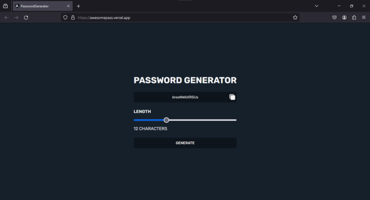

# Password Generator

This is a password generator project that leverages modern technologies to provide secure and random passwords in a simple and efficient manner. The backend is built using Node.js with the Express framework, while the frontend is developed in Angular, utilizing TypeScript and SCSS for a dynamic and stylized user experience.

